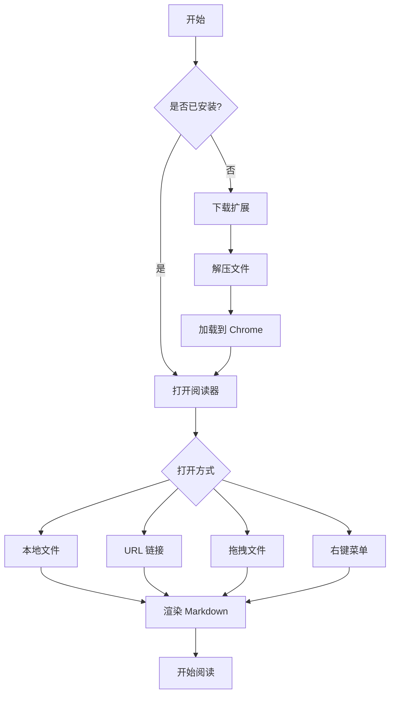
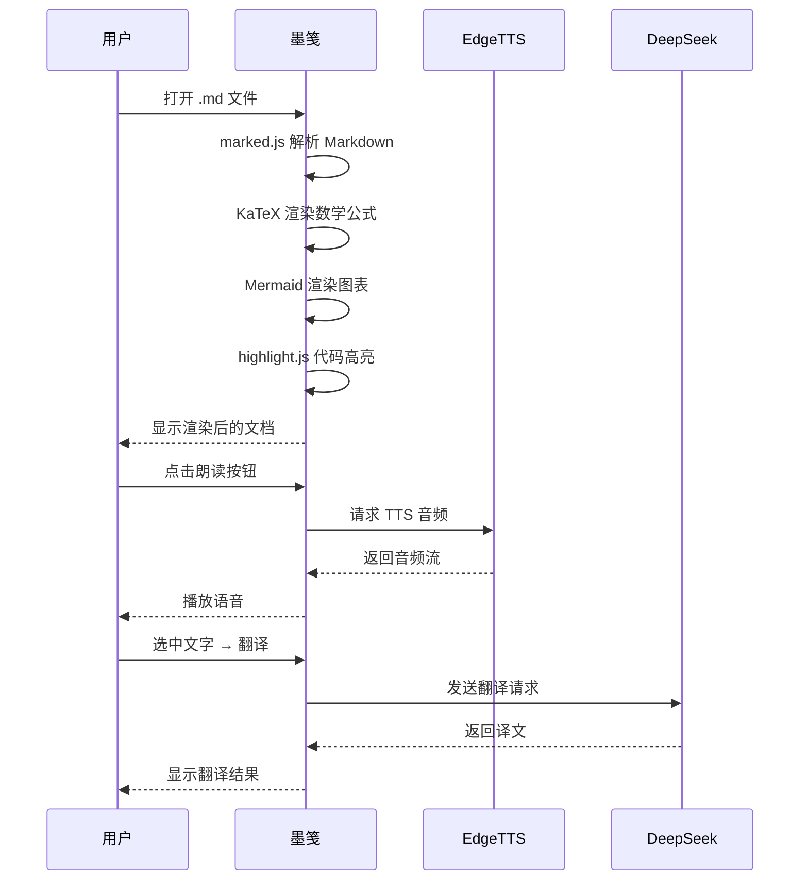
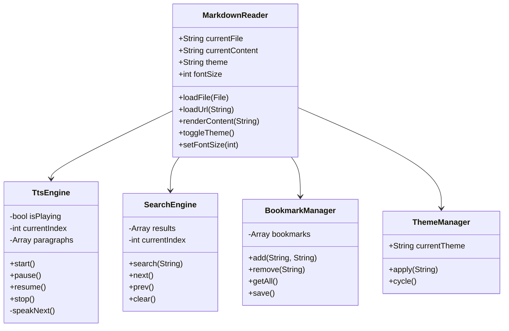
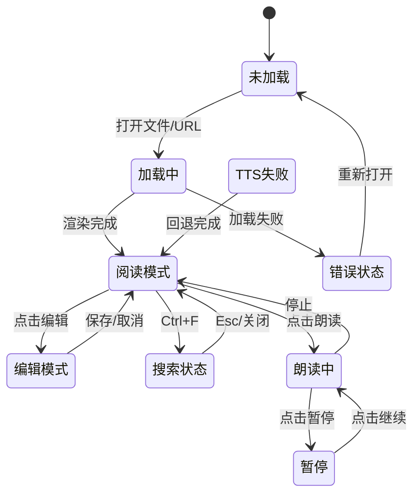
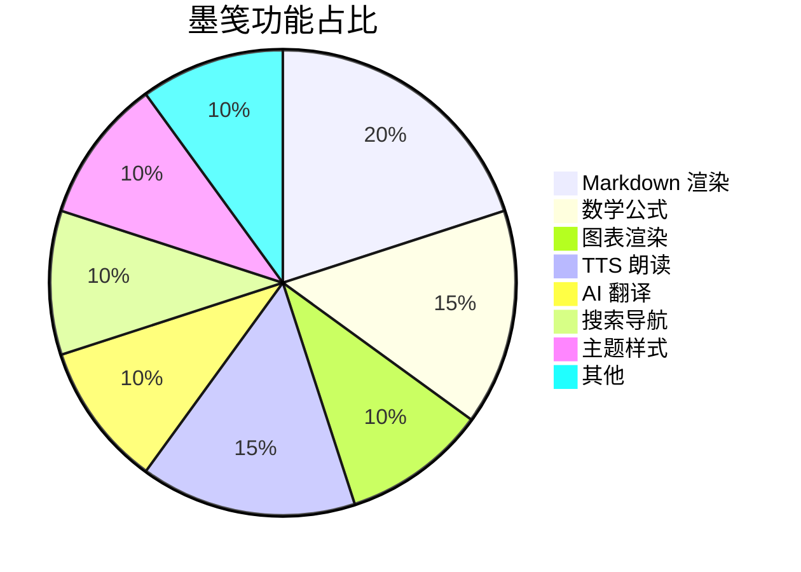
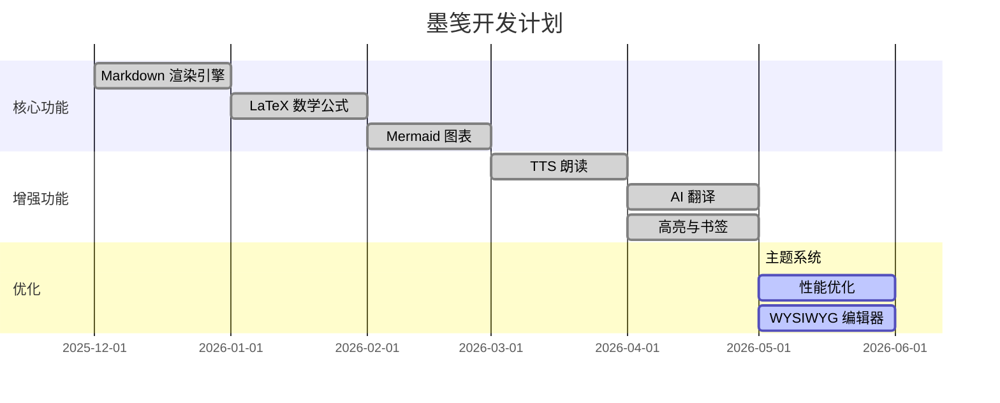

# 墨笺 InkNote 浏览器扩展 — 完整功能测试文档

> 版本: v2.0 | 用途: 测试墨笺 Chrome 扩展的所有渲染、交互和特殊场景
> 最后更新: 2026-06

---

## 📋 目录

[TOC]

---

## 一、基础 Markdown 渲染测试

### 1.1 标题层级

# 一级标题 H1
## 二级标题 H2
### 三级标题 H3
#### 四级标题 H4
##### 五级标题 H5
###### 六级标题 H6

### 1.2 段落与换行

这是第一段。普通段落文本，用于测试基本的段落渲染效果。

这是第二段，与上一段之间应该有空行。  
这是同一段内的换行（行尾两个空格），应该显示为软换行。

### 1.3 文本样式

**粗体文字** 和 *斜体文字* 以及 ***粗斜体***。

~~删除线文本~~ 和 ==高亮文本==（如果支持）。

普通文本中的 `行内代码` 样式。

上标: X^2^, 下标: H~2~O（如果扩展支持）。

### 1.4 分隔线

上面是分隔线，下面是不同风格的：

---

***

_ _ _

---

## 二、列表渲染测试

### 2.1 无序列表

- 苹果
- 香蕉
- 樱桃
  - 车厘子（二级缩进）
  - 甜樱桃（二级缩进）
    - 深红色品种（三级缩进）
- 榴莲

### 2.2 有序列表

1. 第一步：安装扩展
2. 第二步：打开 .md 文件
3. 第三步：开始阅读
   1. 使用大纲导航（二级）
   2. 使用搜索功能（二级）
4. 第四步：享受阅读

### 2.3 混合列表

- 一级无序项
  1. 嵌套有序项 1
  2. 嵌套有序项 2
- 另一个一级无序项
  - 再嵌套无序项

### 2.4 任务列表（GFM）

- [x] 已完成任务
- [ ] 未完成任务
- [ ] 待办事项 A
  - [x] 子任务 1（已完成）
  - [ ] 子任务 2（未完成）
- [x] Markdown 渲染
- [x] LaTeX 数学公式
- [ ] TTS 朗读
- [ ] AI 翻译
- [ ] 导出 HTML

### 2.5 定义列表（如果支持）

Markdown
: 一种轻量级标记语言，由 John Gruber 创建。

GTD
: Getting Things Done，时间管理方法。

---

## 三、链接与图片测试

### 3.1 普通链接

- [GitHub](https://github.com)
- [墨笺项目](https://github.com/gzmliang/mojian-extension)
- [带标题的链接](https://example.com "示例网站标题")

### 3.2 引用式链接

这是一个[引用链接][ref1]和另一个[引用链接][ref2]。

[ref1]: https://example.com/page1 "页面1"
[ref2]: https://example.com/page2 "页面2"

### 3.3 自动链接

直接访问: <https://github.com/gzmliang/mojian-extension>
邮箱地址: <test@example.com>

### 3.4 图片


### 3.5 图片链接

[](https://github.com)

---

## 四、代码块测试

### 4.1 行内代码

在 JavaScript 中，用 `console.log('Hello')` 打印日志。
`const` 声明的变量不能重新赋值。
使用 `npm install` 安装依赖包。

### 4.2 基础代码块（无语言标注）

```
这是一段没有语言标注的代码块
纯文本格式
多行展示
```

### 4.3 JavaScript 代码块

```javascript
// 墨笺核心函数示例
function renderMarkdown(content) {
  const html = marked.parse(content, { breaks: true, gfm: true });
  document.getElementById('content').innerHTML = html;
  
  // 渲染数学公式
  if (typeof renderMathInElement === 'function') {
    renderMathInElement(document.getElementById('content'), {
      delimiters: [
        { left: '$$', right: '$$', display: true },
        { left: '$', right: '$', display: false },
      ],
      throwOnError: false,
    });
  }
  
  return html;
}

// 异步 TTS 朗读
async function speak(text, voice = 'zh-CN-XiaoxiaoNeural') {
  try {
    const resp = await fetch('http://localhost:5001/tts', {
      method: 'POST',
      headers: { 'Content-Type': 'application/json' },
      body: JSON.stringify({ text, voice }),
    });
    if (resp.ok) {
      const blob = await resp.blob();
      const audio = new Audio(URL.createObjectURL(blob));
      audio.play();
    }
  } catch (err) {
    console.error('TTS failed, falling back to Web Speech:', err);
    const utter = new SpeechSynthesisUtterance(text);
    utter.lang = 'zh-CN';
    speechSynthesis.speak(utter);
  }
}

// 搜索高亮
function searchInContent(query) {
  const marks = document.querySelectorAll('mark.search-highlight');
  marks.forEach(m => {
    const parent = m.parentNode;
    parent.replaceChild(document.createTextNode(m.textContent), m);
    parent.normalize();
  });
  
  if (!query) return;
  
  const treeWalker = document.createTreeWalker(
    document.getElementById('content'),
    NodeFilter.SHOW_TEXT
  );
  
  const matches = [];
  while (treeWalker.nextNode()) {
    const node = treeWalker.currentNode;
    const idx = node.textContent.toLowerCase().indexOf(query.toLowerCase());
    if (idx !== -1) {
      matches.push({ node, start: idx, end: idx + query.length });
    }
  }
  
  matches.forEach(({ node, start, end }) => {
    const range = document.createRange();
    range.setStart(node, start);
    range.setEnd(node, end);
    const mark = document.createElement('mark');
    mark.className = 'search-highlight';
    range.surroundContents(mark);
  });
}
```

### 4.4 Python 代码块

```python
from dataclasses import dataclass
from typing import List, Optional
import json


@dataclass
class Bookmark:
    """书签数据模型"""
    section_id: str
    title: str
    timestamp: float
    color: str = "#fef08a"


class BookmarkManager:
    """书签管理器"""
    
    def __init__(self):
        self.bookmarks: List[Bookmark] = []
        self._load()
    
    def _load(self):
        """从 localStorage 加载书签"""
        raw = localStorage.getItem('inknote_bookmarks')
        if raw:
            data = json.loads(raw)
            self.bookmarks = [Bookmark(**b) for b in data]
    
    def save(self):
        """持久化书签"""
        data = [
            {
                'section_id': b.section_id,
                'title': b.title,
                'timestamp': b.timestamp,
                'color': b.color,
            }
            for b in self.bookmarks
        ]
        localStorage.setItem('inknote_bookmarks', json.dumps(data))
    
    def add(self, section_id: str, title: str) -> Bookmark:
        bm = Bookmark(section_id=section_id, title=title)
        self.bookmarks.append(bm)
        self.save()
        return bm
    
    def remove(self, section_id: str) -> bool:
        before = len(self.bookmarks)
        self.bookmarks = [b for b in self.bookmarks if b.section_id != section_id]
        if len(self.bookmarks) != before:
            self.save()
            return True
        return False
    
    def get_all(self) -> List[Bookmark]:
        return sorted(self.bookmarks, key=lambda b: b.timestamp, reverse=True)
```

### 4.5 CSS 代码块

```css
/* 墨笺三主题变量系统 */
:root {
  --bg: #ffffff;
  --text: #1a1a1a;
  --accent: #2563eb;
  --code-bg: #f4f4f5;
  --highlight: #fef08a;
  --tts-highlight: #86efac;
  --search-highlight: #fde68a;
  --border: #e0e0e0;
}

[data-theme="dark"] {
  --bg: #1a1a2e;
  --text: #e0e0e0;
  --accent: #60a5fa;
  --code-bg: #1f2937;
  --highlight: #854d0e;
  --tts-highlight: #065f46;
  --search-highlight: #92400e;
  --border: #374151;
}

[data-theme="sepia"] {
  --bg: #fbf7ed;
  --text: #5b4636;
  --accent: #8b6914;
  --code-bg: #f5f0e6;
  --highlight: #e8d5a3;
  --border: #d4c5a9;
}

/* 阅读内容样式 */
#content {
  max-width: 800px;
  margin: 0 auto;
  line-height: 1.8;
}

#content h1 { font-size: 28px; font-weight: 700; }
#content h2 { font-size: 22px; font-weight: 600; }
#content blockquote {
  margin: 12px 0;
  padding: 8px 16px;
  border-left: 4px solid var(--accent);
  background: var(--code-bg);
  border-radius: 0 8px 8px 0;
}

#content pre {
  padding: 16px;
  background: var(--code-bg);
  border-radius: 8px;
  overflow-x: auto;
}

mark.tts-active {
  background: var(--tts-highlight) !important;
  transition: background 0.3s;
}

mark.search-highlight {
  background: var(--search-highlight);
  padding: 0 2px;
  border-radius: 2px;
}
```

### 4.6 HTML 混合代码块

```html
<!DOCTYPE html>
<html lang="zh-CN">
<head>
  <meta charset="UTF-8">
  <meta name="viewport" content="width=device-width, initial-scale=1.0">
  <title>墨笺测试页</title>
  <link rel="stylesheet" href="styles.css">
</head>
<body>
  <header id="app-header">
    <div class="header-left">
      <span class="app-logo">◇ 墨笺</span>
      <span class="file-name" id="fileName">测试文档</span>
    </div>
    <div class="header-right">
      <button class="btn-icon" title="搜索">🔍</button>
      <button class="btn-icon" title="朗读">🔊</button>
      <button class="btn-icon" title="主题">☀️</button>
      <button class="btn-icon" title="设置">⚙️</button>
    </div>
  </header>
</body>
</html>
```

### 4.7 长代码块（测试横向滚动）

```javascript
// 这是一个故意写得很长的行，用来测试代码块是否需要横向滚动。如果渲染正确，这一行应该超出屏幕范围并且出现滚动条，不会自动换行破坏代码格式。
const veryLongString = "这是一个非常非常非常非常非常非常非常非常非常非常非常非常非常非常非常非常非常非常非常长的字符串，用于测试代码块的横向滚动功能是否正常工作。好的好的好的好的好的好的好的好的好的好的。";
```

---

## 五、引用块测试

### 5.1 基本引用

> 这是一段简单的引用文本。
> 引用可以跨多行。
> 这是第三行。

### 5.2 嵌套引用

> 第一层引用
>
> > 第二层嵌套引用
> >
> > > 第三层嵌套引用
>
> 回到第一层

### 5.3 引用中的其他元素

> ## 引用内的标题
>
> 引用内可以包含**粗体**和*斜体*。
>
> - 引用内的列表项 1
> - 引用内的列表项 2
>
> `code` 也可以出现在引用中。
>
> > 引用嵌套引用

---

## 六、表格测试

### 6.1 标准表格

| 功能 | 状态 | 优先级 | 备注 |
|------|:----:|:------:|:-----|
| Markdown 渲染 | ✅ | P0 | marked.js 引擎 |
| LaTeX 公式 | ✅ | P0 | KaTeX 渲染 |
| Mermaid 图表 | ✅ | P1 | 需 strict 模式 |
| TTS 朗读 | ✅ | P0 | Edge TTS + Web Speech |
| AI 翻译 | ✅ | P1 | DeepSeek API |
| 高亮标注 | ✅ | P0 | localStorage 持久化 |
| 书签管理 | ✅ | P1 | 段落级书签 |
| 全文搜索 | ✅ | P0 | Ctrl+F 触发 |
| 大纲导航 | ✅ | P0 | 侧边栏 |
| 主题切换 | ✅ | P0 | Light/Dark/Sepia |
| 导出 HTML | ✅ | P2 | 下载 |

### 6.2 对齐方式测试

| 左对齐 | 居中对齐 | 右对齐 |
|:-------|:--------:|-------:|
| 文本 A | 文本 B | 文本 C |
| 123 | 456 | 789 |
| 左左左 | 中中中 | 右右右 |

### 6.3 复杂表格

| 序号 | 姓名 | 年龄 | 城市 | 职业 | 邮箱 |
|:---:|:----|:---:|:----|:----|:----|
| 1 | 张三 | 28 | 北京 | 工程师 | zhangsan@example.com |
| 2 | 李四 | 32 | 上海 | 设计师 | lisi@example.com |
| 3 | 王五 | 25 | 广州 | 产品经理 | wangwu@example.com |
| 4 | 赵六 | 35 | 深圳 | 架构师 | zhaoliu@example.com |

### 6.4 无表头表格

| 苹果 | 香蕉 | 樱桃 |
| 10元 | 5元 | 30元 |
| 2斤 | 3斤 | 1斤 |

### 6.5 单列表格

| 只有一列 |
|:---------|
| 内容 1 |
| 内容 2 |
| 内容 3 |

---

## 七、LaTeX 数学公式测试

### 7.1 行内公式

爱因斯坦的质能方程 $E = mc^2$ 是物理学中最著名的公式之一。

勾股定理: $a^2 + b^2 = c^2$

欧拉公式: $e^{i\pi} + 1 = 0$

二次方程求根: $x = \frac{-b \pm \sqrt{b^2 - 4ac}}{2a}$

极限: $\lim_{x \to 0} \frac{\sin x}{x} = 1$

### 7.2 块级公式

$$
\int_{a}^{b} f(x) \, dx = F(b) - F(a)
$$

$$
\sum_{n=1}^{\infty} \frac{1}{n^2} = \frac{\pi^2}{6}
$$

$$
\nabla \times \vec{E} = -\frac{\partial \vec{B}}{\partial t}
$$

$$
\begin{pmatrix}
a_{11} & a_{12} & a_{13} \\
a_{21} & a_{22} & a_{23} \\
a_{31} & a_{32} & a_{33}
\end{pmatrix}
$$

### 7.3 复杂公式

$$
f(x) = 
\begin{cases}
\frac{x^2 - 1}{x - 1}, & x \neq 1 \\
2, & x = 1
\end{cases}
$$

$$
\Gamma(z) = \int_{0}^{\infty} t^{z-1} e^{-t} \, dt
$$

$$
\hat{\beta} = (X^T X)^{-1} X^T y
$$

### 7.4 化学方程式（如果扩展支持）

水的电离: $H_2O \rightleftharpoons H^+ + OH^-$

光合作用: $6CO_2 + 6H_2O \xrightarrow{光} C_6H_{12}O_6 + 6O_2$

---

## 八、Mermaid 图表测试

### 8.1 流程图



### 8.2 时序图



### 8.3 类图



### 8.4 状态图



### 8.5 饼图



### 8.6 甘特图



---

## 九、HTML 内嵌测试

### 9.1 基本 HTML

<div style="border: 2px solid #2563eb; padding: 12px; border-radius: 8px; background: #f0f4ff;">
  <p style="color: #1a1a1a; margin: 0;"><strong>✅ 这是一个内嵌 HTML 的 div 容器</strong></p>
  <p style="color: #666; margin: 8px 0 0 0;">如果墨笺正确渲染，这个框应该有蓝色边框和浅蓝背景。</p>
</div>

### 9.2 HTML 表格

<table>
  <tr>
    <th style="background: #2563eb; color: white; padding: 8px;">ID</th>
    <th style="background: #2563eb; color: white; padding: 8px;">名称</th>
    <th style="background: #2563eb; color: white; padding: 8px;">状态</th>
  </tr>
  <tr>
    <td style="padding: 6px; border: 1px solid #ddd;">001</td>
    <td style="padding: 6px; border: 1px solid #ddd;">渲染测试</td>
    <td style="padding: 6px; border: 1px solid #ddd; color: green;">通过</td>
  </tr>
  <tr>
    <td style="padding: 6px; border: 1px solid #ddd;">002</td>
    <td style="padding: 6px; border: 1px solid #ddd;">数学公式</td>
    <td style="padding: 6px; border: 1px solid #ddd; color: green;">通过</td>
  </tr>
  <tr>
    <td style="padding: 6px; border: 1px solid #ddd;">003</td>
    <td style="padding: 6px; border: 1px solid #ddd;">Mermaid</td>
    <td style="padding: 6px; border: 1px solid #ddd; color: orange;">部分支持</td>
  </tr>
</table>

### 9.3 HTML 细节/折叠

<details>
  <summary><strong>点击展开更多信息</strong></summary>
  <p>这是折叠内容的第一段。</p>
  <p>这是第二段内容，<span style="color: red;">红色文字</span>用于测试内联样式。</p>
  <ul>
    <li>折叠列表项 1</li>
    <li>折叠列表项 2</li>
  </ul>
</details>

### 9.4 HTML 颜色与字体

<p style="font-size: 18px; color: #2563eb;">蓝色 18px 文字</p>
<p style="font-size: 14px; color: #dc2626;">红色 14px 文字</p>
<p style="font-family: 'Courier New', monospace; background: #f4f4f5; padding: 4px 8px;">
  等宽字体 + 灰色背景行内代码样式
</p>

---

## 十、转义与特殊字符测试

### 10.1 Markdown 转义

\*这不是斜体\* 而是普通星号

\_这不是斜体\_ 而是普通下划线

\~\~这不是删除线\~\~

\`这不是代码\`

### 10.2 HTML 实体

&amp; (和号)  &lt; (小于)  &gt; (大于)  &quot; (引号)

&copy; 2026 墨笺  &reg; 注册商标符号

### 10.3 特殊 Unicode

中文: 你好世界 · 墨笺 InkNote
日文: こんにちは
韩文: 안녕하세요
俄文: Привет мир
阿拉伯文: مرحبا بالعالم
表情符号: 🎉 ✅ ❌ ⚠️ 🚀 💡 📚 🔍 🔊 ⚙️

### 10.4 长链接

https://github.com/gzmliang/mojian-extension/blob/main/reader.js?foo=bar&baz=qux#L123-L456

---

## 十一、脚注测试

这里有一个脚注引用[^1]，这是另一个[^2]。

[^1]: 这是第一个脚注的内容，包含详细的说明文字。
[^2]: 这是第二个脚注，也可以包含**格式化**文字。

也可以使用行内脚注^(行内脚注内容)^。

---

## 十二、围栏（Fence）与对齐测试

> [!NOTE]
> 这是一个笔记提示块，用于测试 GitHub 风格的警示语法。

> [!WARNING]
> 这是一个警告提示块。

> [!TIP]
> 这是一个技巧提示。

> [!CAUTION]
> 这是一个小心警示。

---

## 十三、大文本块测试

### 13.1 超长段落

这是一个超长段落的测试文本。我们需要确保墨笺的阅读器能够正确处理非常长的段落文本，不会出现渲染错误、性能问题或排版异常。长段落应该能够自动换行，保持良好的可读性，同时不会对浏览器的渲染性能造成显著影响。测试中包含了中文、English、数字12345以及各种标点符号——，。！？；：“”‘’——的混合文本，确保阅读器在各种语言混合场景下都能正常工作。Lorem ipsum dolor sit amet, consectetur adipiscing elit, sed do eiusmod tempor incididunt ut labore et dolore magna aliqua. Ut enim ad minim veniam, quis nostrud exercitation ullamco laboris nisi ut aliquip ex ea commodo consequat.

### 13.2 纯符号行

--- *** ___ ... ::: ;;;
！！！？？？、、、。。。——— *** >>> >>>>

### 13.3 特殊格式

| 单字符 | 双字符 | 三字符 |
|:------:|:------:|:------:|
| - | -- | --- |
| * | ** | *** |
| ~ | ~~ | ~~~ |
| > | >> | >>> |
| . | .. | ... |

---

## 十四、YAML Frontmatter 测试

---
title: 测试文档
author: Jimmy
date: 2026-06-04
tags: [测试, markdown, 墨笺]
---

Frontmatter 区域应该被阅读器正确处理，可以选择显示或隐藏。

---

## 十五、边界情况测试

### 15.1 空内容

（下面一行应该是空的）

（上面一行应该是空的）

### 15.2 仅空格

   
（上面一行包含 3 个空格）

### 15.3 超长无空格字符串

aaaaaaaaaaaaaaaaaaaaaaaaaaaaaaaaaaaaaaaaaaaaaaaaaaaaaaaaaaaaaaaaaaaaaaaaaaaaaaaaaaaaaaaaaaaaaaaaaaaaaaaaaaaaaaaaaaaaaaaaaaaaaaaaaaaaaaaaaaaaaaaaaaaaaaaaaaaaaaaaaaaaaaaaaaaaaaaaaaaaaaaaaaaaaaaaaaaaaaaaaaaaaaaaaaaaaaaaaaaaaaaaaaaaaaaaaaaaaaaaaaaaaaaaaaaaaaaa

### 15.4 数字列表

1.
2.
3.

### 15.5 重复标题

## 重复标题
## 重复标题
## 重复标题（用于测试大纲去重）

---

## 十六、综合示例

### 16.1 项目 README 风格

# ProjectX

> 下一代知识管理平台

## 功能

- **智能笔记** — 支持 Markdown + LaTeX
- **双向链接** — {{[[双向链接]]}} 知识图谱
- **版本历史** — Git 驱动的变更追踪

### 技术栈

| 层次 | 技术 | 版本 |
|:----|:----|:----:|
| 前端 | React + TypeScript | 18.x |
| 渲染 | marked + KaTeX | 最新 |
| 存储 | IndexedDB | — |
| 同步 | WebSocket | — |

### 快速开始

```bash
# 安装
npm install projectx

# 启动
npx projectx serve --port 3000

# 构建
npx projectx build
```

## API 示例

```python
import projectx

client = projectx.Client(api_key="sk-xxx")
notes = client.notes.search("machine learning")
for note in notes:
    print(f"{note.title}: {note.excerpt}")
```

---

### 16.2 学术论文风格

# 基于混合注意力机制的文本分类方法研究

## 摘要

本文提出了一种基于**混合注意力机制**的文本分类方法 ... 实验结果表明 ...

## 1. 引言

自然语言处理（NLP）领域 ... 近年来，Transformer 架构 $Attention(Q,K,V) = softmax(\frac{QK^T}{\sqrt{d_k}})V$ 取得了显著进展。

## 2. 方法

### 2.1 模型架构

$$
\text{输出} = \text{Softmax}(W_o \cdot [h_1; h_2; ...; h_n] + b_o)
$$

### 2.2 损失函数

$$
\mathcal{L} = -\frac{1}{N} \sum_{i=1}^{N} \sum_{j=1}^{C} y_{ij} \log(p_{ij})
$$

## 3. 实验

| 模型 | 准确率 | F1 分数 | 参数量 |
|:----|:-----:|:-------:|:-----:|
| BiLSTM | 89.2% | 88.7% | 12M |
| BERT | 93.5% | 93.1% | 110M |
| **Ours** | **95.1%** | **94.8%** | **45M** |

---

## 测试覆盖统计

| 测试类别 | 测试项数 | 说明 |
|:---------|:-------:|:-----|
| 基础 Markdown | 12 | 标题/段落/样式/分隔线 |
| 列表 | 15 | 有序/无序/嵌套/任务/定义 |
| 链接与图片 | 8 | URL/引用/自动/图片/图片链接 |
| 代码块 | 12 | 行内/多语言/长行/HTML混合 |
| 引用块 | 10 | 嵌套/复杂引用 |
| 表格 | 12 | 对齐/复杂/单列/无表头 |
| LaTeX 公式 | 14 | 行内/块级/复杂/化学 |
| Mermaid 图表 | 8 | 流程图/时序/类图/状态/饼图/甘特 |
| HTML 内嵌 | 8 | div/表格/折叠/样式 |
| 转义与特殊字符 | 10 | 转义/实体/Unicode/长链接 |
| 脚注 | 3 | 引用/行内 |
| 警示块 | 4 | NOTE/WARNING/TIP/CAUTION |
| 大文本 | 5 | 长段落/纯符号/特殊格式 |
| 边界情况 | 8 | 空内容/空格/长字符串/重复 |
| **合计** | **约 130** | 覆盖全部功能场景 |
